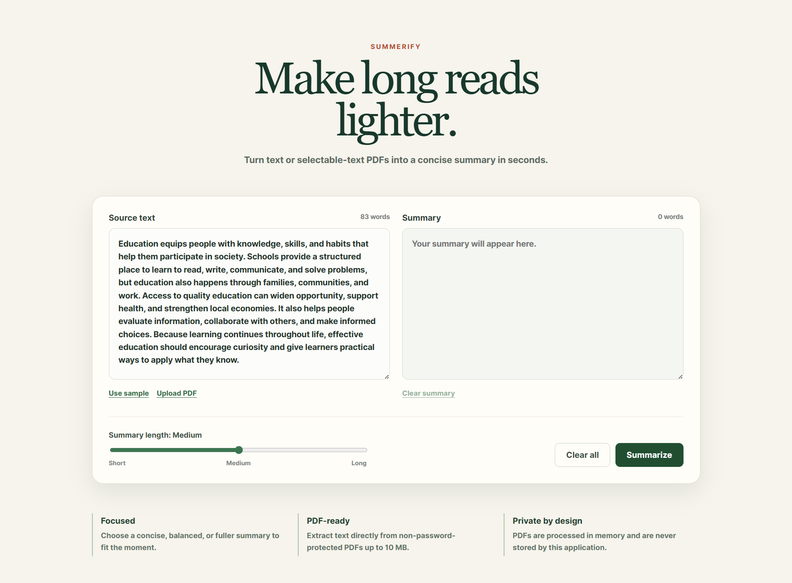

# Summerify

A full-stack AI-powered text summarization application built using **Spring Boot**, **React**, and the **Hugging Face Inference API**.

<p align="center">
  
</p>

## Run Locally

### 1. Clone the Repository

```bash
git clone https://github.com/KartikBawake/Summerify.git
cd Summerify
```

### 2. Add Your Hugging Face API Token

Open:

```text
backend/src/main/resources/application.properties
```

Replace the placeholder with your Hugging Face API token:

```properties
huggingface.api.token=YOUR_HUGGING_FACE_API_TOKEN
```

> You can generate a free API token from your Hugging Face account under **Settings → Access Tokens**.

### 3. Run the Backend

Open a terminal and run:

```bash
cd backend
./mvnw spring-boot:run
```

> **Windows**

```bash
.\mvnw.cmd spring-boot:run
```

### 4. Run the Frontend

Open a **new terminal** and run:

```bash
cd frontend
npm install
npm run dev
```

### 5. Open the Application

Visit:

```text
http://localhost:5173
```

---

## Features

- 📝 AI-powered text summarization
- 📄 PDF text extraction
- 🤖 Hugging Face Inference API integration
- ⚡ Spring Boot REST API backend
- ⚛️ React + Vite frontend
- 🔄 Real-time communication between frontend and backend
- 🎨 Clean and responsive user interface
